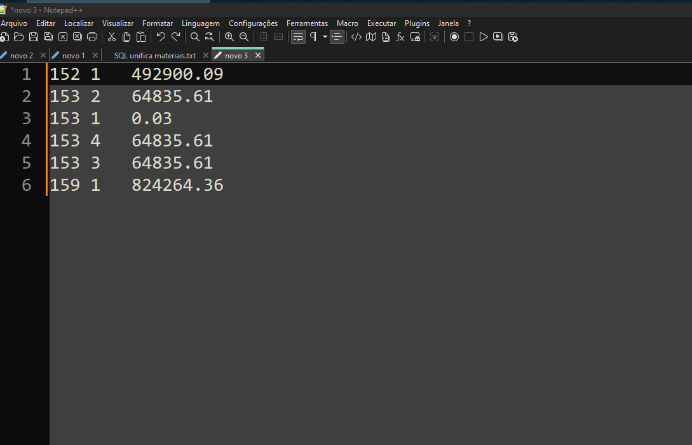

# Macros
Exemplo de utilização do recurso com a ferramenta notepadd++.

As macros são uma ferramenta poderosa para automatizar tarefas repetitivas em diversas aplicações. Com elas, é possível gravar uma sequência de ações e reproduzi-la posteriormente com um único clique ou atalho de teclado.

Este exemplo demonstra como utilizar macros para inserir automaticamente a instrução seguida de uma lista numerada de passos. **É importante notar que este é apenas um exemplo das diversas possibilidades de uso das macros.** Você pode adaptá-las para automatizar qualquer tarefa que realize repetidamente, como formatação de texto, substituição de palavras-chave, organização de dados e muito mais.

As macros podem ser particularmente úteis para:

* **Formatação de código:** Padronizar a indentação, adicionar comentários ou formatar elementos específicos da sua linguagem de programação.
* **Edição de texto:** Substituir palavras-chave, adicionar ou remover linhas, ajustar espaçamento e realizar outras modificações em massa.
* **Organização de dados:** Classificar linhas, remover duplicatas, extrair informações específicas e realizar outras operações em conjuntos de dados.
* **Tarefas repetitivas:** Automatizar qualquer sequência de ações que você precise realizar repetidamente, economizando tempo e aumentando sua produtividade.

Para utilizar este exemplo específico com o notepad++, siga as instruções abaixo:

1. **Seleção e pesquisa de TAB:**
   * Selecione o texto que contém as colunas que você deseja separar.
   * Utilize a função de pesquisa da sua aplicação (ex: `Ctrl + F` ou equivalente).
   * Insira um espaço em branco no campo de pesquisa.
   * Utilize a opção de pesquisa por expressão regular, se disponível.
   * Encontre todas as ocorrências de TAB no seu texto.
   * **Dica:** Utilize a tecla `F3` (ou equivalente) para navegar rapidamente entre os resultados da pesquisa e garantir que você capturou todos os separadores de coluna (TAB).

2. **Gravação da macro:**
   * Posicione o cursor no ponto desejado.
   * Inicie a gravação da macro.
   * Realize as ações que você deseja automatizar, como inserir "Instruções:" e formatar a lista numerada.
   * Pare a gravação da macro.

3. **Execução da macro:**
   * Execute a macro múltiplas vezes ou uma única vez, conforme sua necessidade.

Explore as macros e descubra como elas podem facilitar o seu trabalho!

